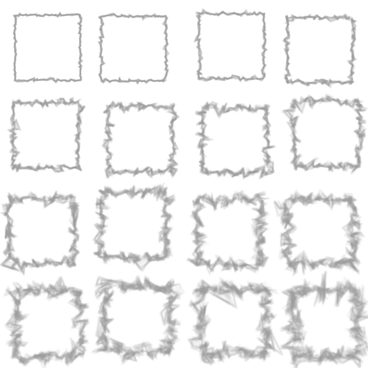
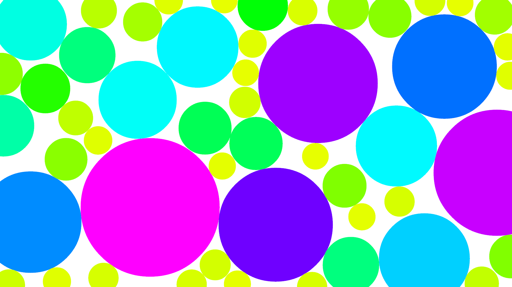
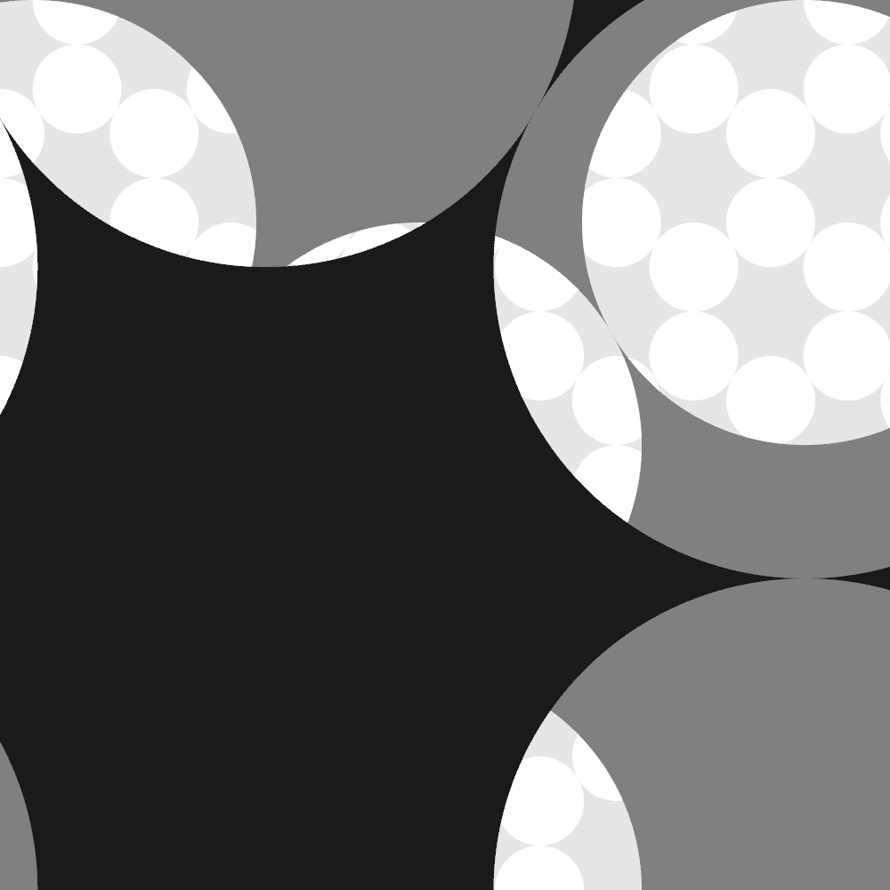
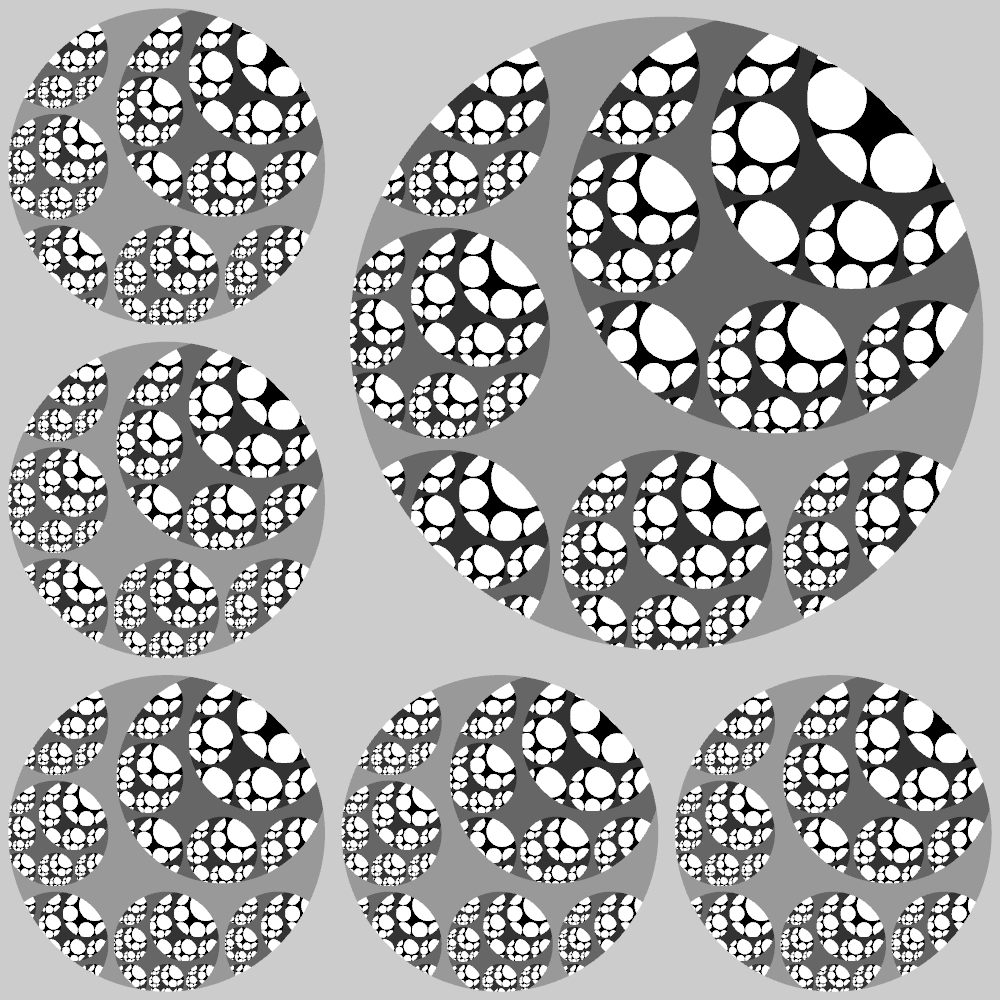
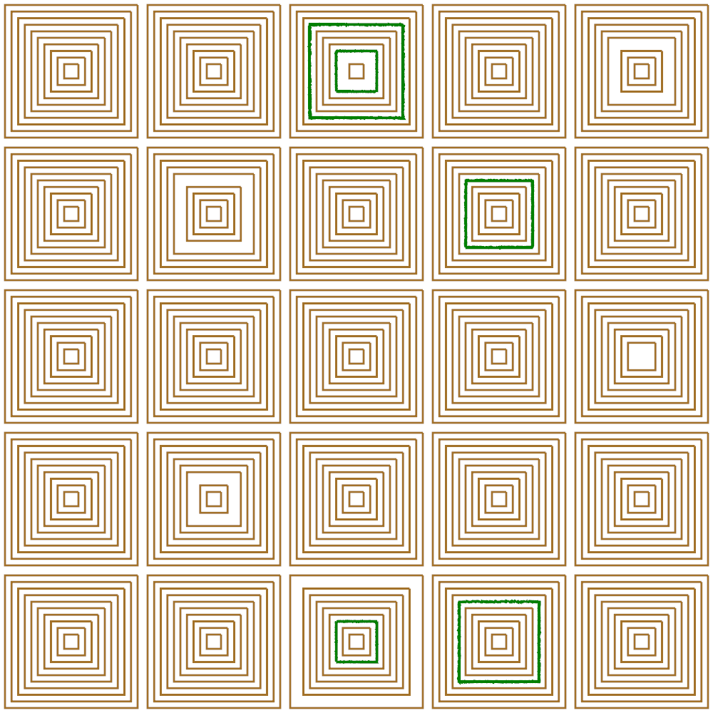
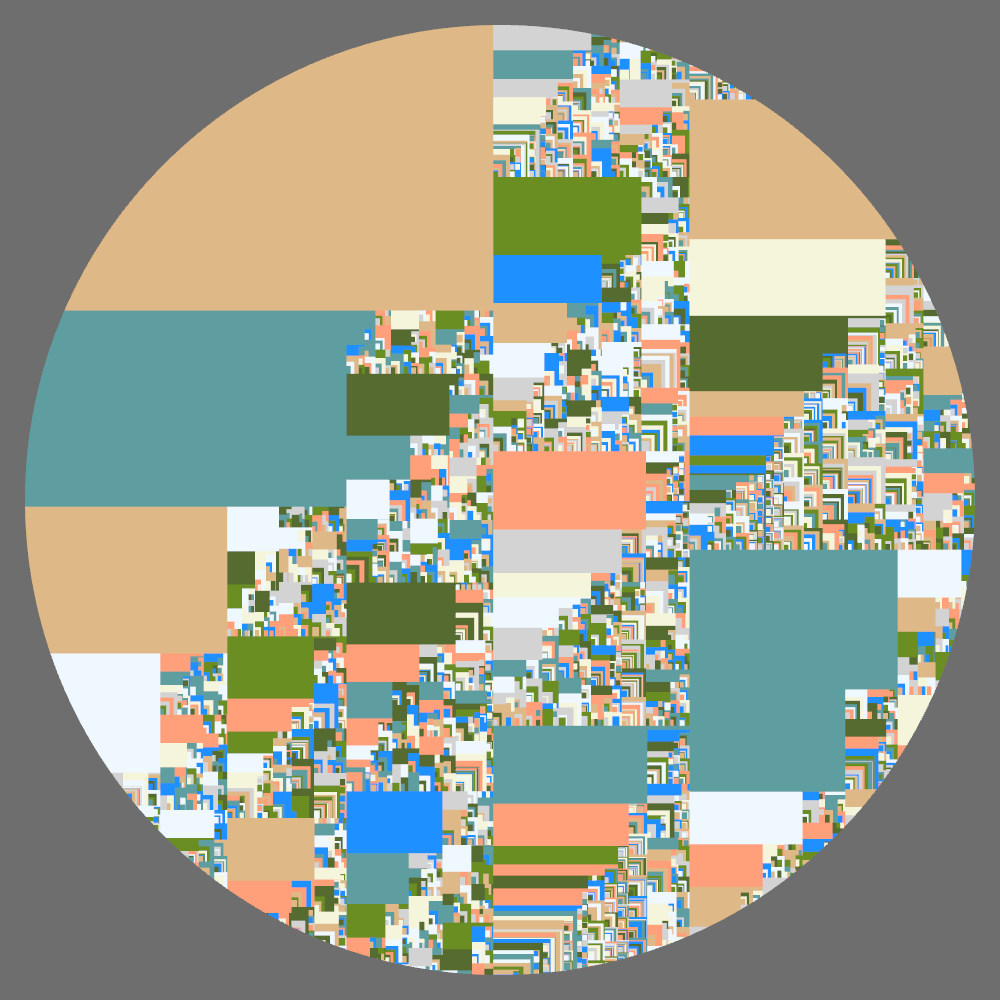
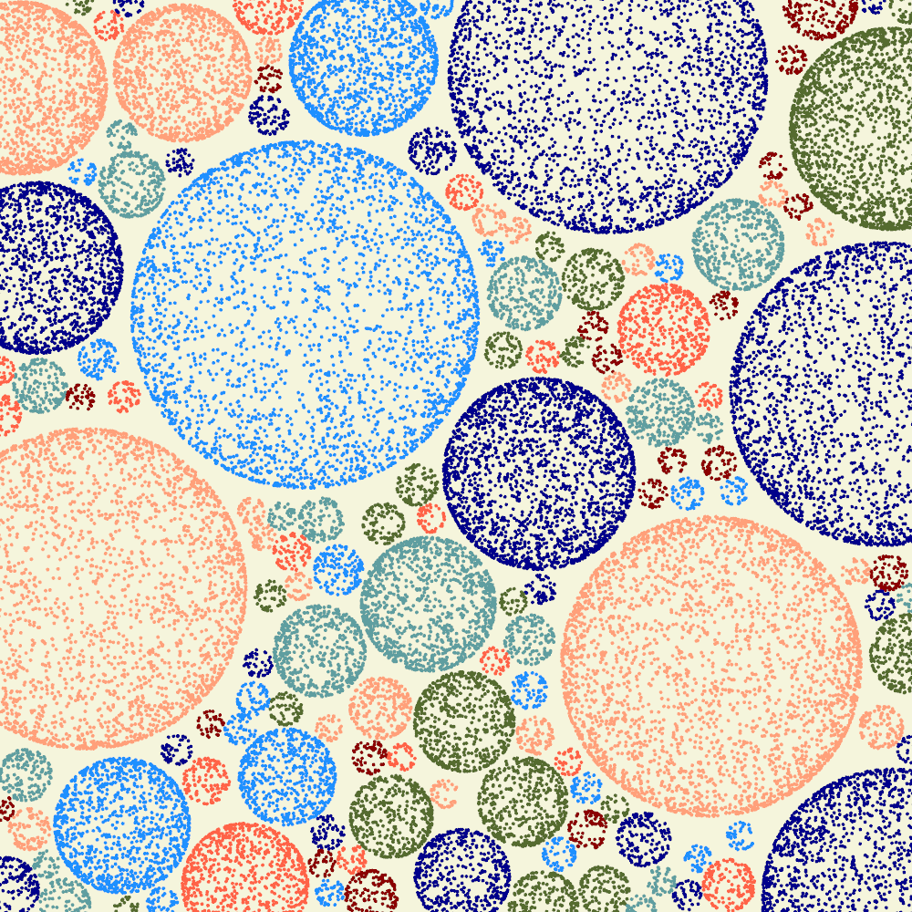

# sketches

## ギャラリー

### 2022/05/18


### 2022/05/19



### 2022/05/24



### 2022/05/31


### 2022/06/05



### 2022/06/06



### 2022/06/08



### 2022/06/27



### 2022/06/28


### 2022/07/01



## Gifの作り方

```bash
$ ffmpeg -i image_%03d.png -filter_complex "[0:v] fps=5,scale=1000:-1,split [a][b];[a] palettegen [p];[b][p] paletteuse" output.gif
```

* `scale=1000:-1` はwidthを1000pxにして、heightはアスペクト比率を維持する
